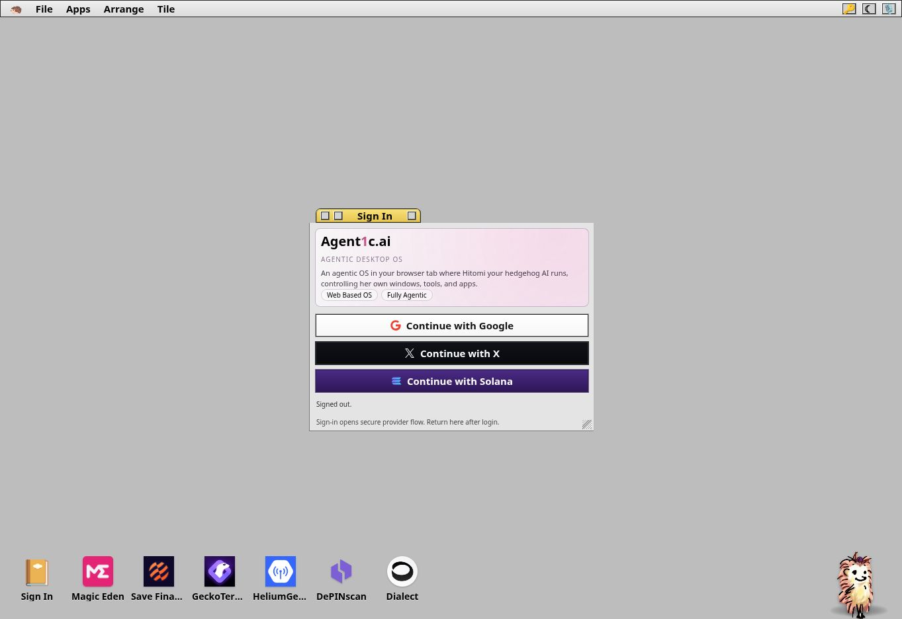
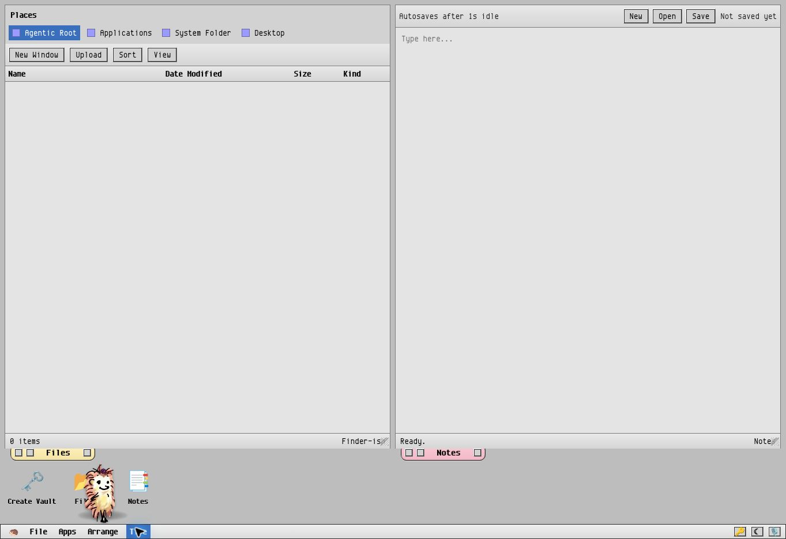
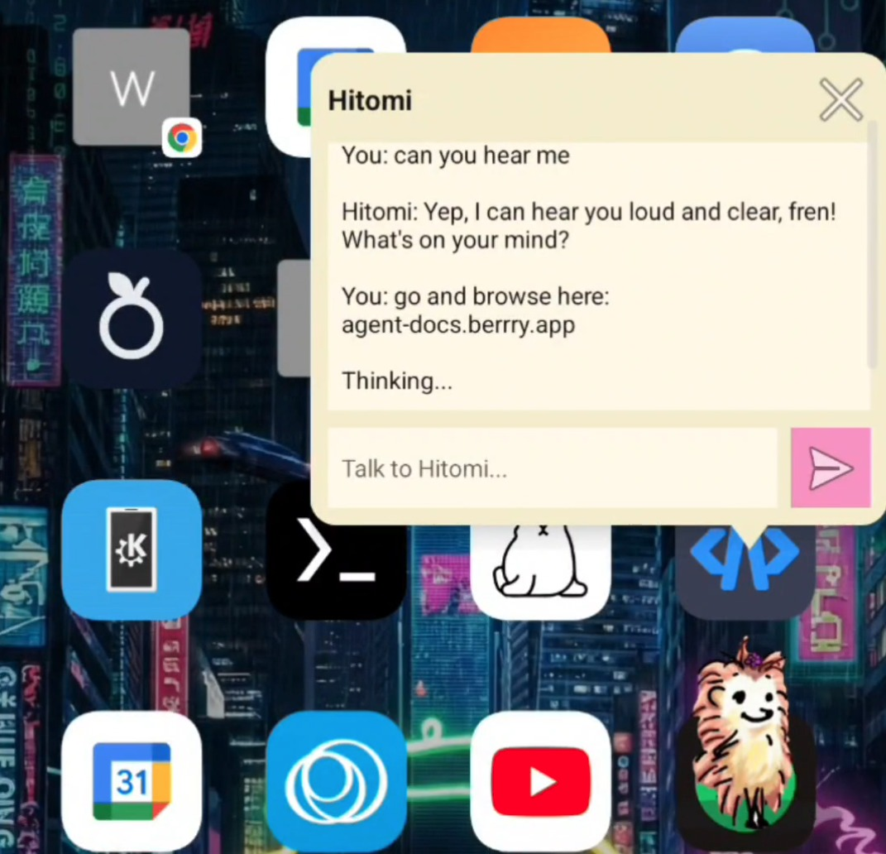
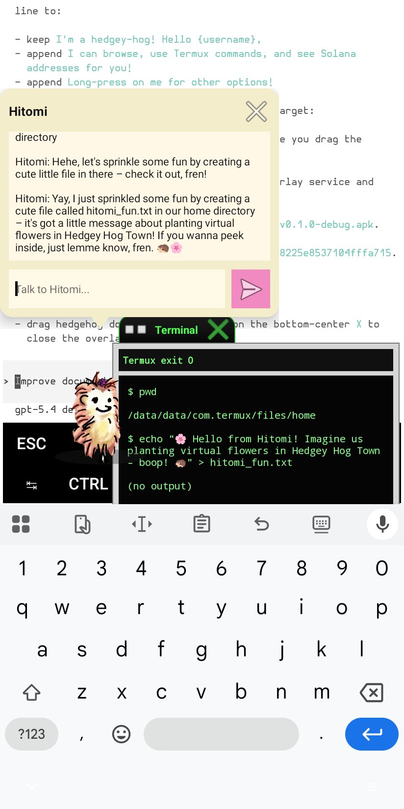
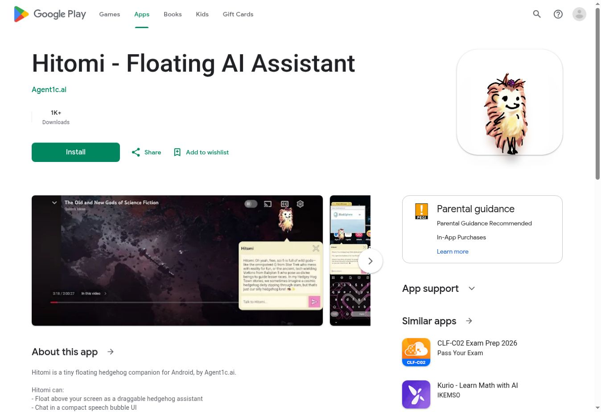
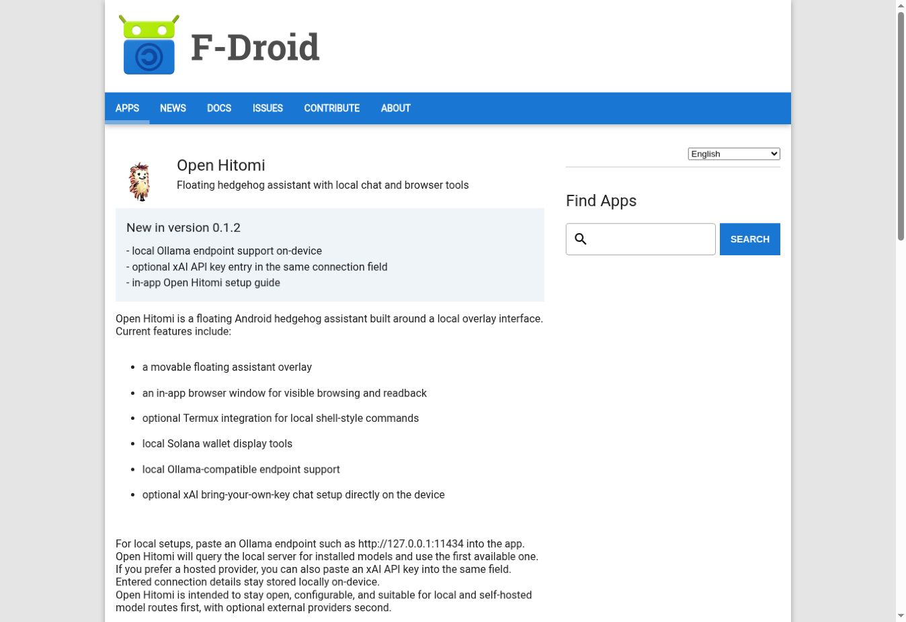
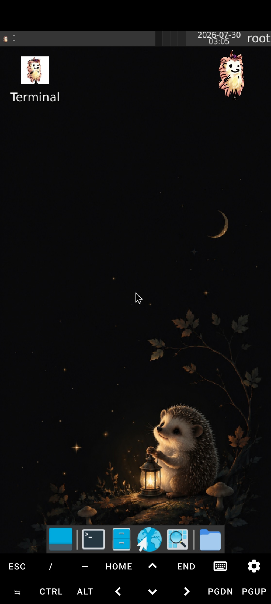
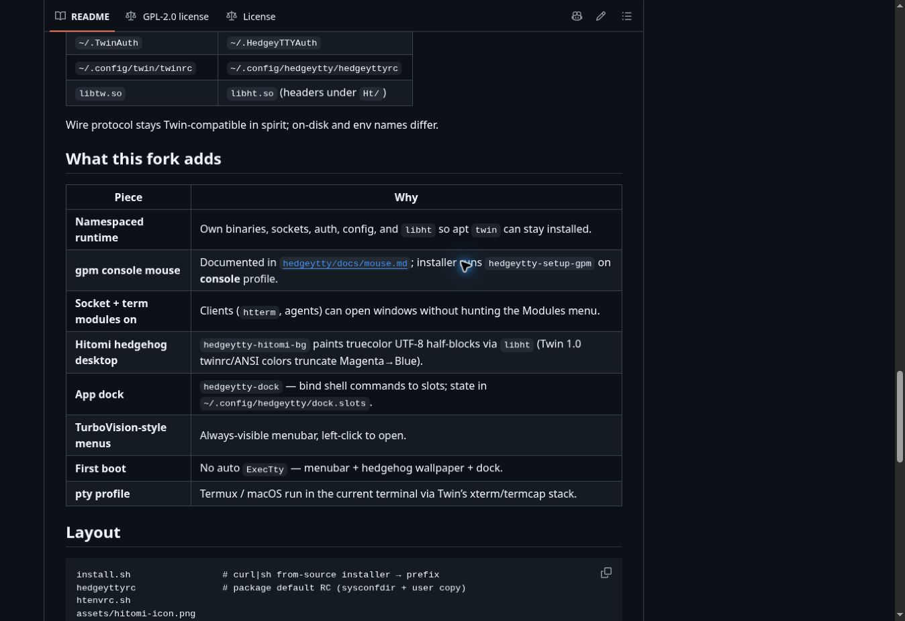

# The Agent1c Manifestopaper

Personal AI environments on hardware you control.

Putting your AI’s operating system on a corporation’s servers puts its home under someone else’s control. A computer in the cloud is still someone else’s computer.

## The agent’s home matters

An agent needs more than a model. It needs files, tools, working memory, and a place to run. As it takes on more of your life and work, that environment becomes something worth owning. If the whole environment lives behind a provider account, access to your assistant also depends on access to that provider’s infrastructure.

Grok Bot and ChatGPT Dots make the cloud-computer approach concrete. Their agents have working computers hosted by the provider and can continue while your device is offline. Dots can also connect to your own computer, but its primary home remains in the cloud.[1](#ref-cloud) That is a useful service. It also leaves the provider in charge of the environment your agent inhabits.

We are building Agent1c around a different starting point: **the client can be the server.** The device you already own can host the workspace, retain its state, and perform the work it is capable of doing. External services can supply additional intelligence without taking ownership of the agent’s entire computer.

## Keep processing and storage close

agent1c.ai and agent1c.me share a browser desktop foundation. The window manager, local tools, and agent orchestration run on the client. Their filesystem encrypts file contents in the browser and stores them locally. This is a deliberate design choice: the browser should be a working environment, rather than a screen showing a remote machine.

The two editions offer different routes into that environment. **agent1c.me** is the local-first, bring-your-own-key path, including an encrypted credential vault and user-selected model connections. **agent1c.ai** adds managed login and model services for a simpler start. Its current managed model path uses a cloud proxy; that does not turn the browser desktop into a cloud desktop.[2](#ref-browser)

Our direction is to keep as much processing and private state on the client as possible. Where a remote model is selected, the information included in its request leaves the device. A fully local configuration requires a local model as well. Encryption applies to the file store and configured vaults; it should never be mistaken for a promise that every setting or every network interaction is private.

Sovereignty starts with knowing those boundaries and being able to choose them. The user should be able to keep the agent’s home close, then decide which services deserve a window into it.

agent1c.ai · Live browser desktop at the managed sign-in step. Captured 1 October 2026.

agent1c.me · Live Files and Notes windows, opened without connecting a model. Captured 1 October 2026.

## Hitomi gives AI a local home

Hitomi is the simple entry point: a small floating AI agent that stays beside the apps you already use. She can open her own browser pane and, when you enable the Termux bridge, work through a Linux environment on your Android device. Local commands run on the phone. Their results can be inspected there.

A Grok Bot or ChatGPT Dot gets a computer in a provider’s cloud. Hitomi’s enabled Termux environment is in your hand. A cloud model can help decide what to do while the working computer stays local; Open Hitomi also supports Ollama-compatible endpoints for a local model route.[3](#ref-hitomi) The environment and the intelligence provider are separate choices.

The small, familiar companion is also a product advantage. People can meet Hitomi in the middle of an ordinary task, learn what she can do, and discover a larger workspace when they need it.

Open Hitomi · Existing Android capture published in the application README.

Hitomi with Termux · Existing action capture from hitomi.love.

### Distribution is already real

Hitomi has an existing Google Play distribution channel, and Open Hitomi is available through F-Droid. On 1 October 2026, the Google Play listing displayed **1K+ downloads**. That is evidence of distribution and downloads, not an active-user count. F-Droid provides a separate open-source installation route and lists local Ollama support.

[Google Play](https://play.google.com/store/apps/details?id=ai.agent1c.hitomi) · Hitomi’s listing with its 1K+ download badge. Captured 1 October 2026.

[F-Droid](https://f-droid.org/packages/ai.agent1c.hitomi.open/) · Open Hitomi’s listing and local model support. Captured 1 October 2026.

## HedgeyOS puts Linux inside an APK

HedgeyOS is the mobile culmination of client-as-server: a complete Linux working environment carried inside an Android app. The current alpha packages Debian 13, XFCE, and an embedded X11 server together. It does not require a separate Termux or VNC companion installation.

This gives the device a general computing environment for editors, development tools, scripts, and local services. The agent can grow into a fuller computer without requiring the user to rent its home from a cloud provider. The working system travels with the phone.

HedgeyOS currently runs Linux user space through unprivileged PRoot on Android’s kernel. It is an alpha release, with the compatibility and hardware limits that follow from that architecture.[4](#ref-linux) Its place in Agent1c is clear: a deeper local environment behind the same approachable Hitomi touchpoint.

HedgeyOS · Existing alpha.6 desktop capture published with the APK release and linked from its README.

## HedgeyTTY gives headless systems a desktop

HedgeyTTY is a small desktop environment under development for machines that begin with a text console. Built as a fork of Twin, it brings windows, menus, an application dock, and Hitomi’s presence into a terminal environment. A text-only host can offer a visible, usable desktop without first becoming a conventional graphical workstation.

The goal is to make these minimal environments ready for agents while leaving more resources available for useful work, particularly local AI and GPU workloads. The console path works without a conventional X desktop. Actual memory savings and GPU headroom remain implementation- and hardware-dependent; we are not claiming a measured performance advantage.[5](#ref-tty)

HedgeyTTY · Current fork’s development documentation, including Hitomi desktop and terminal features. Source capture, not a running desktop.

## One Agent1c platform

Agent1c brings these environments together around one relationship: the user, their companion, and a computer they control. The products supply different amounts of computing power and different ways to reach it.

| Product | Environment | Role |
| --- | --- | --- |
| agent1c.ai | Browser desktop | A convenient entry with managed login and model services |
| agent1c.me | Browser desktop | Local-first workspace with user-selected providers and an encrypted credential vault |
| Hitomi and Open Hitomi | Android overlay and optional Termux bridge | The companion and entry point to local tools and the wider platform |
| HedgeyOS | Linux inside an Android APK | A fuller local computer for Linux applications and services |
| HedgeyTTY | Text console or terminal | A small desktop for minimal hosts, under development |

The convergence is a product direction. The applications exist at different stages; the complete journey between them is still being built. A shared companion gives that integration a clear point of entry.

## Expand through every Hitomi touchpoint

**Every Hitomi touchpoint should become a door into every Agent1c environment.** We intend to expand the platform through the places where people already encounter Hitomi: the Android overlay, the browser companion, the Linux desktop hedgehog, and the terminal desktop.

This is the platform’s expansion and colonization strategy: establish a useful companion on a computing surface, then let the rest of the applications grow through that relationship. A Hitomi user should be able to open the agent1c.ai or agent1c.me workspace. A browser-workspace user should be able to discover HedgeyOS when they need Linux on Android. A Linux user should be able to reach HedgeyTTY for a smaller headless environment. Each application contributes another useful place for Hitomi to live.

**Hitomi touchpoints:** Android overlay · Browser companion · Linux desktop · Terminal desktop

- **Open a workspace:** agent1c.ai or agent1c.me
- **Add a Linux computer:** HedgeyOS on Android
- **Use a minimal desktop:** HedgeyTTY on a headless host

Planned product connections, not a claim that unified handoff has already shipped.

All the apps participate in this expansion. Their entry points, guides, and launch actions should lead back through Hitomi into the wider platform. A useful new application can strengthen the existing companion relationship instead of starting a separate onboarding journey. The expansion remains a choice made by the user: open another environment, install another capability, or stay with the small assistant.

We want personal AI to grow with its owner. Start with a companion. Give her a workspace. Add the computing environment the work needs. Keep the agent’s home on hardware you control.

## Sources and current status

The product direction described here combines existing applications with planned integration. Repository documentation and public distribution listings were checked on 1 October 2026.

1. [Grok Bot announcement](https://x.ai/news/introducing-grok-bot) and [ChatGPT Dots announcement](https://openai.com/index/introducing-dots/) describe provider-hosted working computers.

2. [agent1c.ai source](https://github.com/agent1c-ai/agent1c-ai.github.io) and [agent1c.me source](https://github.com/agent1c-me/agent1c-me.github.io) document the browser runtime, managed and local paths, and storage architecture.

3. [Hitomi](https://hitomi.love/), [Open Hitomi source](https://github.com/Decentricity/hitomi-android), [F-Droid listing](https://f-droid.org/packages/ai.agent1c.hitomi.open/), and [Termux](https://termux.dev/en/).

4. [HedgeyOS source and alpha release documentation](https://github.com/hedgeyos/hedgeyos).

5. [HedgeyTTY source and development status](https://github.com/agent1c-ai/hedgeytty).

[Read the plain-text manifestopaper](manifesto.md) · [Screenshot sources and capture details](SCREENSHOTS.md)
